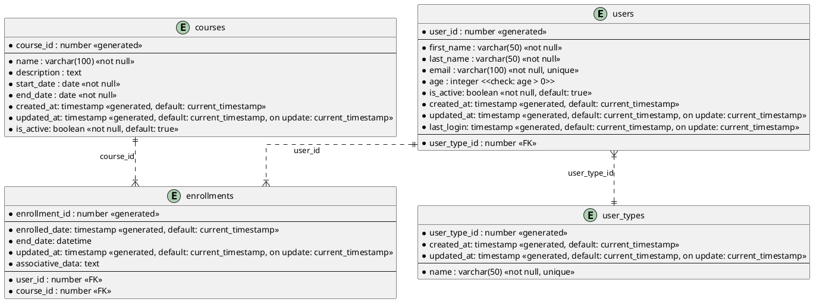

# 1. Database Design

_The database design is subject to change based on the project requirements._

Before creating the relationships between the tables, we need to create the actual database first.

Inside a PSQL client container:

```Bash
postgres=# create database student_management_system_db;
CREATE DATABASE
```

Output when running `\l`:

```Bash
postgres=# \l
                                                                List of databases
             Name             |  Owner   | Encoding | Locale Provider |  Collate   |   Ctype    | ICU Locale | ICU Rules |   Access privileges
------------------------------+----------+----------+-----------------+------------+------------+------------+-----------+-----------------------
 postgres                     | postgres | UTF8     | libc            | en_US.utf8 | en_US.utf8 |            |           |
 student_management_system_db | postgres | UTF8     | libc            | en_US.utf8 | en_US.utf8 |            |           |
 template0                    | postgres | UTF8     | libc            | en_US.utf8 | en_US.utf8 |            |           | =c/postgres          +
                              |          |          |                 |            |            |            |           | postgres=CTc/postgres
 template1                    | postgres | UTF8     | libc            | en_US.utf8 | en_US.utf8 |            |           | =c/postgres          +
                              |          |          |                 |            |            |            |           | postgres=CTc/postgres
(4 rows)
```

## Description

Database design is the process of producing a detailed data model of a database.


This data model contains all the needed logical and physical design choices
and physical storage parameters needed to generate a design in a data definition
language, which can then be used to create a database.

## Entity-Relationship Diagram (ERD)

The goal is to create a simple database schema for a student management system consisting of 2 tables, `students` and `courses`.

But for a more general approach, instead of creating a `students` table we will be creating a `user` table instead, that way we can use the same table for both students and teachers or even more actors eventually.

For this approach we are going to use Single Table Inheritance (STI) pattern.

In Single Table Inheritance, we have one table for both or more entities and use a discriminator column to differentiate between them.



## Tables

### users

The users table will store information about users, such as their name, age, and email.

| Column       | Type      | Description                      |
|--------------|-----------|----------------------------------|
| user_id      | number    | Unique identifier                |
| first_name   | text      | User's first name                |
| last_name    | text      | User's last name                 |
| email        | text      | User's email address             |
| age          | number    | User's age                       |
| is_active    | boolean   | User status (active or inactive) |
| created_at   | timestamp | Record creation timestamp        |
| updated_at   | timestamp | Record update timestamp          |
| last_login   | timestamp | Last login timestamp             |
| user_type_id | number    | User type identifier             |

### user_types

The user_types table will store information about user types, such as student or instructor.

| Column       | Type      | Description               |
|--------------|-----------|---------------------------|
| user_type_id | number    | Unique identifier         |
| name         | text      | User type name            |
| created_at   | timestamp | Record creation timestamp |
| updated_at   | timestamp | Record update timestamp   |

### courses

The courses table will store information about courses, such as the course name and description.

| Column       | Type      | Description               |
|--------------|-----------|---------------------------|
| course_id    | number    | Unique identifier         |
| name         | text      | Course name               |
| description  | text      | Course description        |
| start_date   | date      | Course start date         |
| end_date     | date      | Course end date           |
| is_active    | boolean   | Course status             |
| created_at   | timestamp | Record creation timestamp |    
| updated_at   | timestamp | Record update timestamp   |

### enrollments

The enrollments table will store information about user enrollments in courses.

| Column             | Type        | Description             |
|--------------------|-------------|-------------------------|
| enrollment_id      | number      | Unique identifier       |
| enrolled_date      | timestamp   | Enrollment timestamp    |
| end_date           | datetime    | Enrollment end date     |
| associative_data   | text        | Additional data         |
| user_id            | number      | User identifier         |
| course_id          | number      | Course identifier       |
| updated_at         | timestamp   | Record update timestamp |


## Examples

### users Table

| user_id | first_name | last_name | email                  | age | is_active | created_at          | updated_at          | last_login          | user_type_id |
|---------|------------|-----------|------------------------|-----|-----------|---------------------|---------------------|---------------------|--------------|
| 1       | John       | Doe       | john.doe@example.com   | 21  | true      | 2024-08-15 12:34:56 | 2024-08-15 12:34:56 | 2024-08-15 12:34:56 | 1            |
| 2       | Jane       | Smith     | jane.smith@example.com | 22  | true      | 2024-08-15 12:34:56 | 2024-08-15 12:34:56 | 2024-08-15 12:34:56 | 2            |

### user_types Table

| user_type_id | name    | created_at          | updated_at          |
|--------------|---------|---------------------|---------------------|
| 1            | Student | 2024-08-15 12:34:56 | 2024-08-15 12:34:56 |
| 2            | Teacher | 2024-08-15 12:34:56 | 2024-08-15 12:34:56 |

### courses Table

| course_id | name        | description              | start_date  | end_date    | is_active  | created_at  | updated_at  |
|-----------|-------------|--------------------------|-------------|-------------|------------|-------------|-------------|
| 1         | Python 101  | Basic Python             | 2024-09-01  | 2024-12-15  | true       | 2024-08-15  | 2024-08-15  |
| 2         | Alembic 101 | World Database Migration | 2024-09-01  | 2024-12-15  | true       | 2024-08-15  | 2024-08-15  |

### enrollments Table

| enrollment_id | enrolled_date          | end_date | associative_data | user_id | course_id | updated_at          |
|---------------|------------------------|----------|------------------|---------|-----------|---------------------|
| 1             | 2024-08-15 12:34:56    | NULL     | NULL             | 1       | 1         | 2024-08-15 12:34:56 |
| 2             | 2024-08-15 12:34:56    | NULL     | NULL             | 2       | 2         | 2024-08-15 12:34:56 |


These tables provide a structured view of example records for your student management system's database schema.
