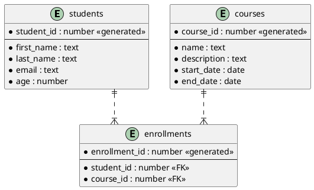

# 1. Database Design

_The database design is subject to change based on the project requirements._

Before creating the relationships between the tables, we need to create the actual database first.

Inside a PSQL client container:

```Bash
postgres=# create database student_management_system_db;
CREATE DATABASE
```

Output when running `\l`:

```Bash
postgres=# \l
                                                                List of databases
             Name             |  Owner   | Encoding | Locale Provider |  Collate   |   Ctype    | ICU Locale | ICU Rules |   Access privileges
------------------------------+----------+----------+-----------------+------------+------------+------------+-----------+-----------------------
 postgres                     | postgres | UTF8     | libc            | en_US.utf8 | en_US.utf8 |            |           |
 student_management_system_db | postgres | UTF8     | libc            | en_US.utf8 | en_US.utf8 |            |           |
 template0                    | postgres | UTF8     | libc            | en_US.utf8 | en_US.utf8 |            |           | =c/postgres          +
                              |          |          |                 |            |            |            |           | postgres=CTc/postgres
 template1                    | postgres | UTF8     | libc            | en_US.utf8 | en_US.utf8 |            |           | =c/postgres          +
                              |          |          |                 |            |            |            |           | postgres=CTc/postgres
(4 rows)
```

## Description

Database design is the process of producing a detailed data model of a database.


This data model contains all the needed logical and physical design choices
and physical storage parameters needed to generate a design in a data definition
language, which can then be used to create a database.

## Entity-Relationship Diagram (ERD)



## Tables

### students

The students table will store information about students,
such as their name, age, and email.

| Column       | Type      | Description          |
|--------------|-----------|----------------------|
| student_id   | number    | Unique identifier    |
| first_name   | text      | Student's first name |
| last_name    | text      | Student's last name  |
| email        | text      | Student's email      |
| age          | number    | Student's age        |

### courses

The courses table will store information about courses,

such as the course name and description.

| Column       | Type      | Description         |
|--------------|-----------|---------------------|
| course_id    | number    | Unique identifier   |
| name         | text      | Course name         |
| description  | text      | Course description  |
| start_date   | date      | Course start date   |
| end_date     | date      | Course end date     |

### enrollments

The enrollments table will store information about student enrollments in courses.

| Column        | Type    | Description           |
|---------------|---------|-----------------------|
| enrollment_id | number  | Unique identifier     |
| student_id    | number  | Student identifier    |
| course_id     | number  | Course identifier     |

## Examples

Students:

| student_id | first_name | last_name | email                     | age |
|------------|------------|-----------|---------------------------|-----|
| 1          | Safet      | Imamovic  | safet.imamovic.22@size.ba | 21  |

Courses:

| course_id  | name                 | description                 | start_date | end_date   |
|------------|----------------------|-----------------------------|------------|------------|
| 1          | Python               | Python course               | 2024-03-01 | 2024-07-01 |
| 2          | Discrete Mathematics | Discrete Mathematics course | 2024-05-11 | 2024-09-11 |

Enrollments:

| enrollment_id    | student_id | course_id |
|------------------|------------|-----------|
| 1                | 1          | 1         |
| 2                | 1          | 2         |

